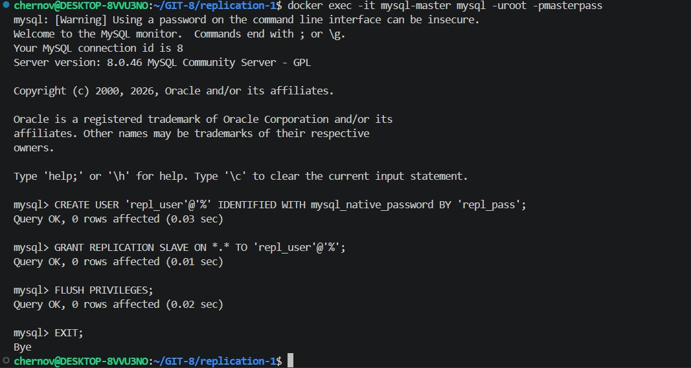
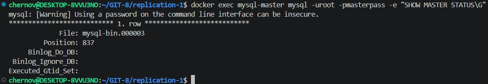
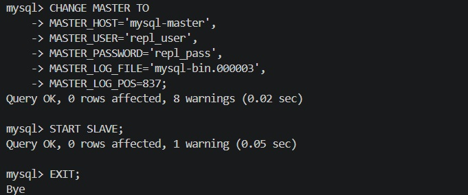
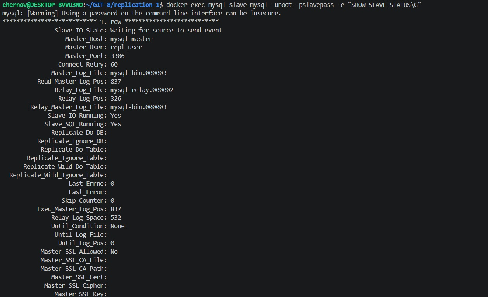
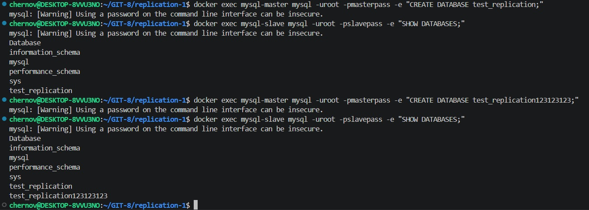

# Домашнее задание к занятию "`Репликация и масштабирование. Часть 1`" - `Chernov Vyacheslav`

## Задание 1
На лекции рассматривались режимы репликации master-slave, master-master, опишите их различия.

Ответить в свободной форме.

## Задание 2
Выполните конфигурацию master-slave репликации, примером можно пользоваться из лекции.

Приложите скриншоты конфигурации, выполнения работы: состояния и режимы работы серверов.

# Решение.
 
## Задание 1
На лекции рассматривались режимы репликации master-slave, master-master, опишите их различия.

Master-Slave — это когда у нас есть один основной сервер (master), который принимает все изменения (запись данных), и один или несколько вспомогательных серверов (slaves), которые только копируют эти изменения и отдают данные на чтение. Запись возможна только на master. Если master выходит из строя — запись останавливается, но чтение может продолжаться со slaves.

Master-Master — это когда у нас два (или больше) серверов, и каждый из них может принимать как запись, так и чтение. Изменения, сделанные на одном сервере, автоматически передаются на другой, и наоборот. Это даёт отказоустойчивость записи, но усложняет настройку и может приводить к конфликтам, если одни и те же данные меняются одновременно на обоих серверах.

## Задание 2
Выполните конфигурацию master-slave репликации, примером можно пользоваться из лекции.

Создание пользователя repl_user на master

Координаты для репликации

Настройка slave

Репликация активна

Данные реплицируются

